# Generated UI mockups

These 13 images were generated during the initial Open Era design conversation. They are preserved at their original 940×1672 resolution as design history and visual reference.

Written decisions in [`docs/design`](../../design/README.md) take precedence over image details. Names, numbers, icons, resource categories, and controls inside the images are placeholders rather than implementation requirements.

## Current-direction references

| Preview | File | Purpose |
| --- | --- | --- |
| 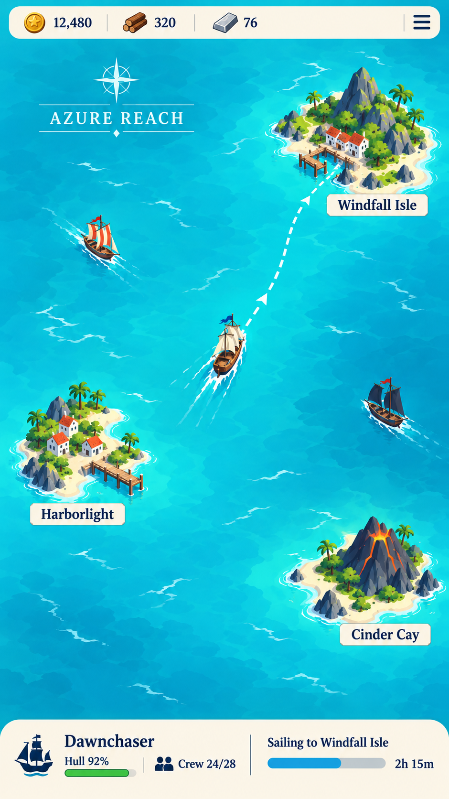 | [`map-region-overview.png`](map-region-overview.png) | Minimal map with ship condition and travel footer |
| 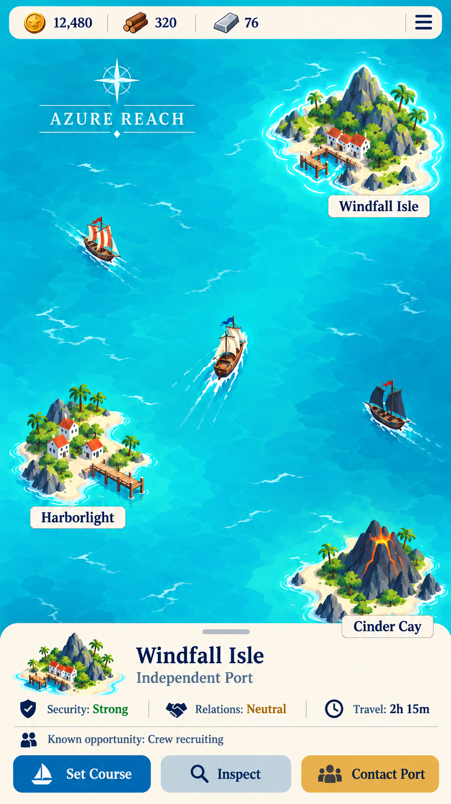 | [`map-island-selected.png`](map-island-selected.png) | Selected-island state and contextual actions |
| 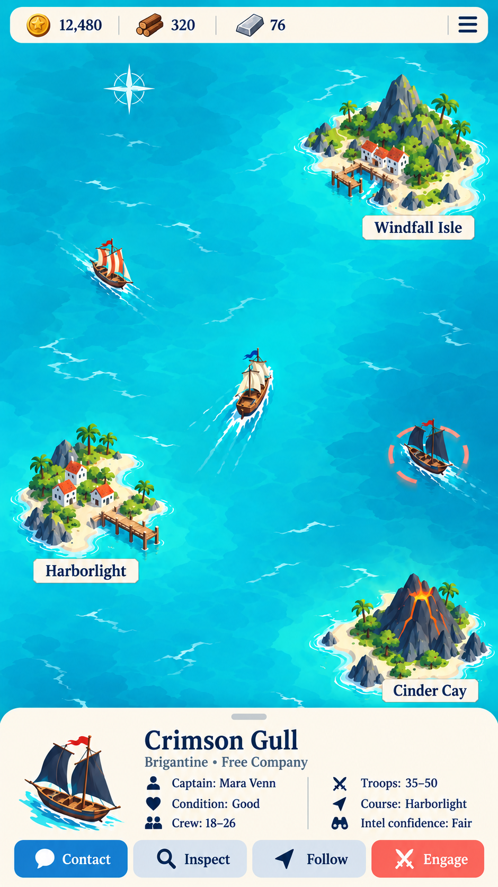 | [`map-ship-selected.png`](map-ship-selected.png) | Selected-ship state and compact party statistics |
| 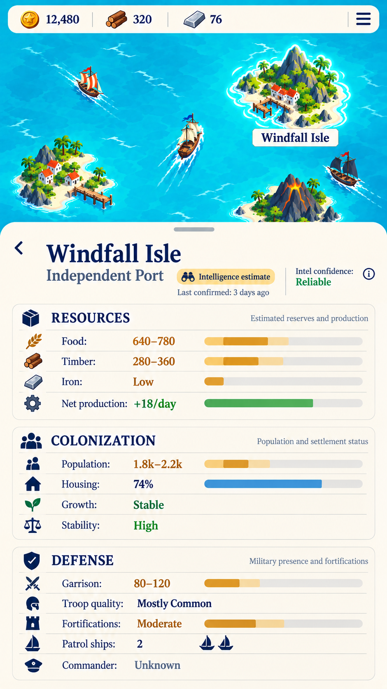 | [`island-inspection.png`](island-inspection.png) | Resource, colonization, and defense inspection |
| 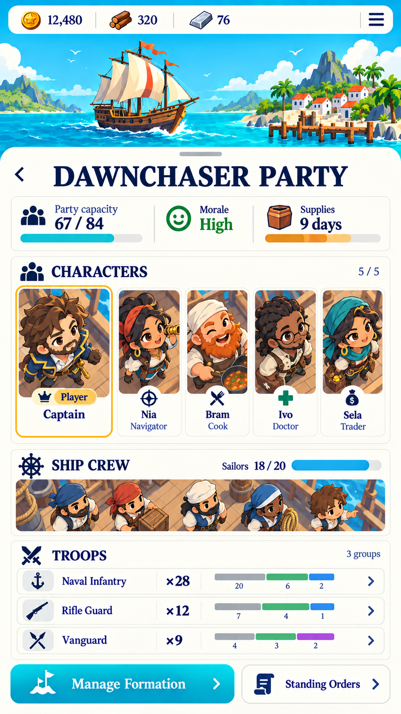 | [`party-overview-chibi.png`](party-overview-chibi.png) | Current chibi three-quarter top-down character direction |
| 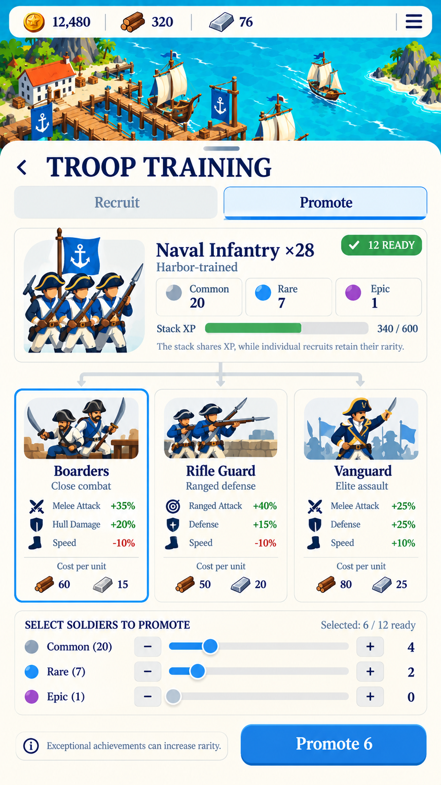 | [`troop-training.png`](troop-training.png) | Troop branches, rarity, experience, and promotions |
| 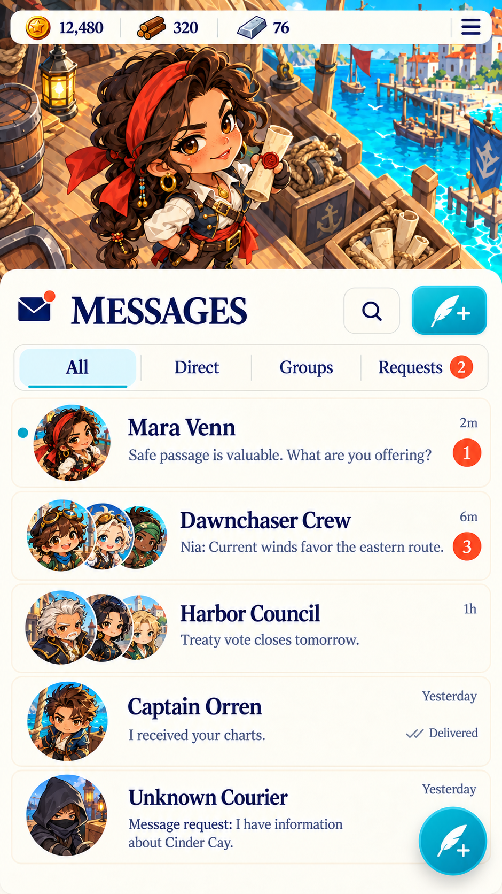 | [`messages-inbox.png`](messages-inbox.png) | Persistent DM/group/request inbox |
| 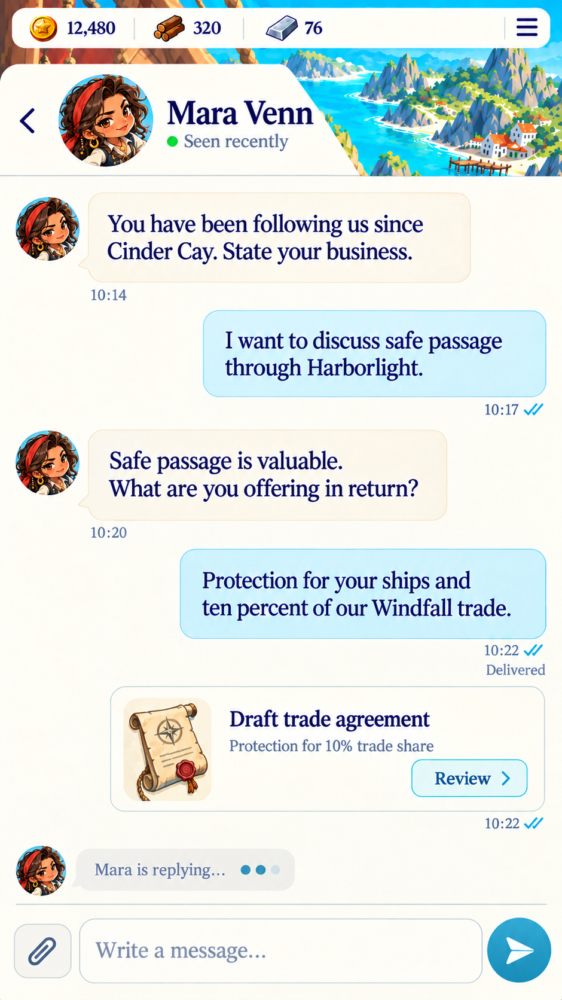 | [`direct-message-thread.png`](direct-message-thread.png) | Free-form asynchronous negotiation with an attachment card |

## Iteration and superseded references

| Preview | File | Status |
| --- | --- | --- |
| 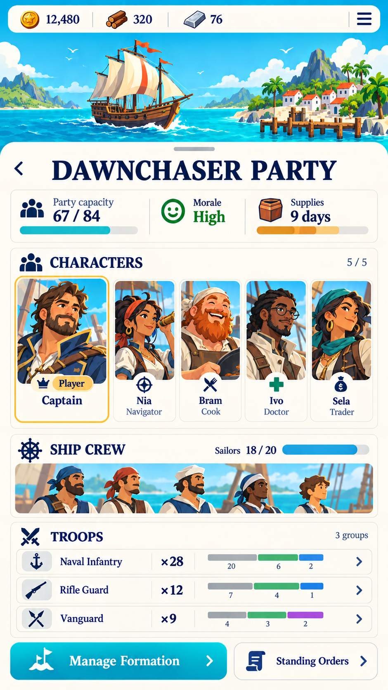 | [`party-overview-standard.png`](party-overview-standard.png) | Superseded character rendering; layout remains useful |
| 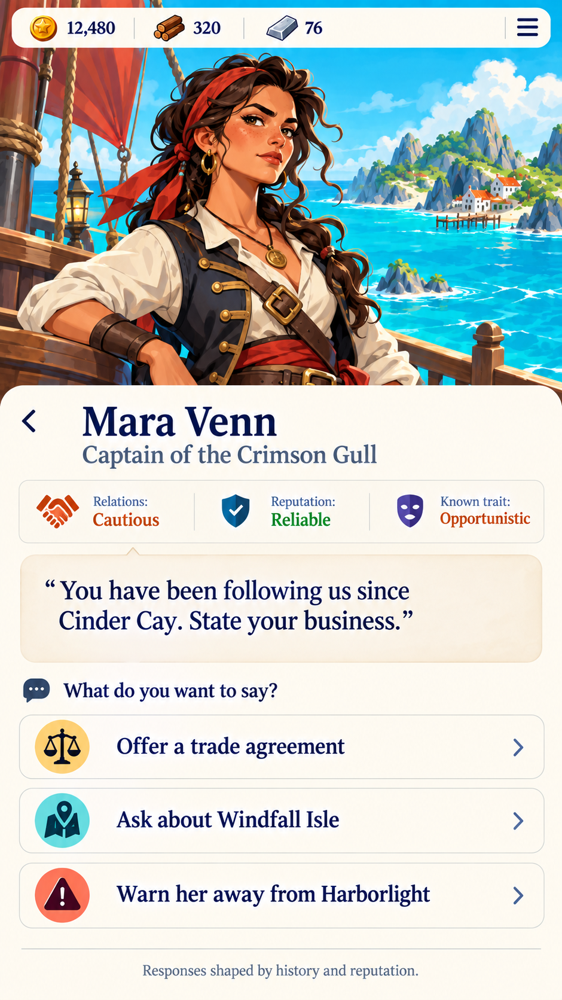 | [`conversation-choices-list.png`](conversation-choices-list.png) | Superseded local conversation with stacked choices |
| 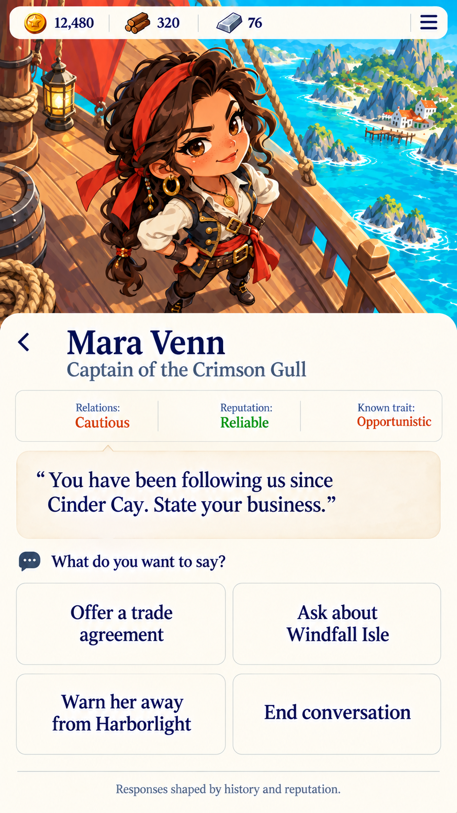 | [`conversation-choices-grid-chibi.png`](conversation-choices-grid-chibi.png) | Chibi/grid iteration, superseded by free-form chat |
| 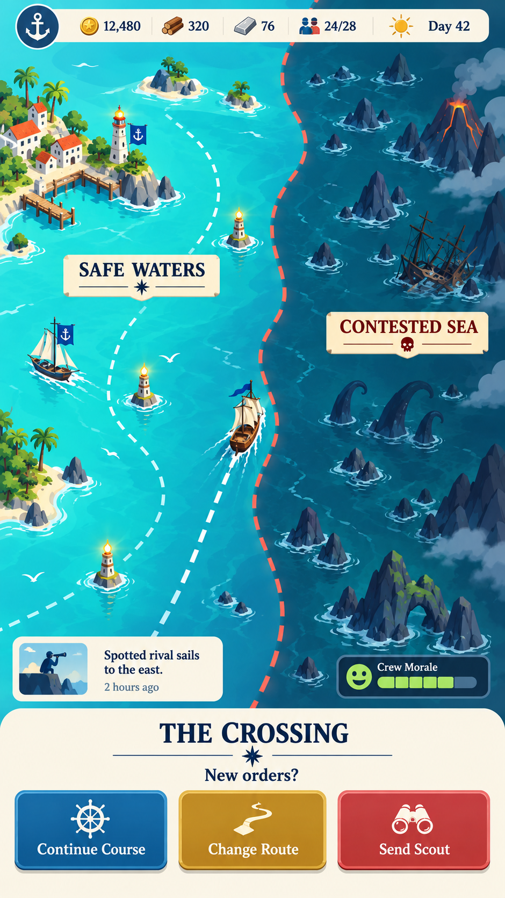 | [`map-crossing-bright.png`](map-crossing-bright.png) | Early map with the now-removed “The Crossing” panel |
| 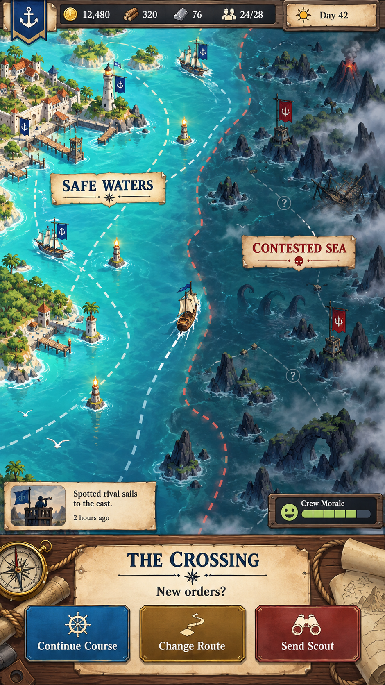 | [`map-crossing-dark.png`](map-crossing-dark.png) | Earliest dense regional-map iteration |

## Source manifest

| Repository file | Original generated asset ID |
| --- | --- |
| `conversation-choices-list.png` | `exec-0714d037-e159-4074-ac4d-3edd3622a106.png` |
| `conversation-choices-grid-chibi.png` | `exec-1399fdb7-bdf8-46b9-bc96-f3b0ebd92da7.png` |
| `map-ship-selected.png` | `exec-1b66b2c8-160a-41ed-841e-0d39ab5430d6.png` |
| `party-overview-standard.png` | `exec-1bed6ea6-d5a4-46df-9650-59b7621f29ef.png` |
| `messages-inbox.png` | `exec-1fbd041f-bf52-4212-b71a-092af2513726.png` |
| `troop-training.png` | `exec-21bc93d9-2486-4864-aa45-5c427a5567e6.png` |
| `party-overview-chibi.png` | `exec-228e7a3d-b8fd-421c-bf04-0d4a23dad6d7.png` |
| `map-crossing-bright.png` | `exec-4572f757-0df2-4776-8845-44d6904df894.png` |
| `map-region-overview.png` | `exec-4ce09b97-bf14-4e94-862a-1029004351c3.png` |
| `map-island-selected.png` | `exec-7ec37c20-b090-4300-997c-44d1fc52b6de.png` |
| `direct-message-thread.png` | `exec-9b3e55ed-e90d-4aa3-8dd6-14e2ba1d9d04.png` |
| `island-inspection.png` | `exec-c9458fa9-3fd9-4a5c-a5ad-c7636de58771.png` |
| `map-crossing-dark.png` | `exec-e737e81a-3d98-4562-8718-40653b6b6ee7.png` |
